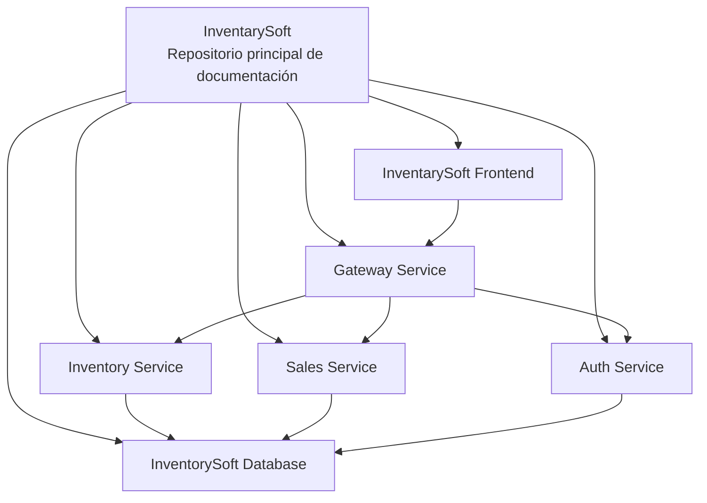

# InventarySoft

## Introducción

<<<<<<< HEAD
InventarySoft es una plataforma de software empresarial distribuida, enfocada en la gestión de inventario, ventas y control de acceso. La solución evolucionó desde una arquitectura monolítica hacia una arquitectura basada en microservicios para mejorar el despliegue independiente, la mantenibilidad y la escalabilidad horizontal.

La plataforma está diseñada con servicios modulares, límites claros por dominio y enrutamiento centralizado mediante el patrón API Gateway. Este enfoque permite crecer de forma controlada y reducir el acoplamiento entre componentes.
=======
El proyecto se desarrolla bajo metodología ágil **Scrum**, con arquitectura modular basada en **microservicios** y repositorios independientes.
>>>>>>> origin/develop

---

## Visión de Arquitectura

<<<<<<< HEAD
InventarySoft se implementa como un sistema distribuido con los siguientes principios:

- Arquitectura de microservicios
- Patrón API Gateway como punto de entrada unificado
- Servicios orientados a dominio para inventario, ventas y autenticación
- Persistencia relacional compartida con acceso controlado por servicio

### Componentes y responsabilidades

| Componente | Responsabilidad |
|---|---|
| Frontend | Interfaz de usuario y experiencia web |
| API Gateway | Enrutamiento de solicitudes y capa de acceso centralizada |
| Inventory Service | Gestión de inventario y catálogo de productos |
| Sales Service | Gestión de ventas y flujos transaccionales |
| Auth Service | Autenticación y autorización |
| Base de Datos PostgreSQL | Persistencia relacional |

---

## Puertos por Entorno

### Base de Datos

| Componente | Main | QA | Dev |
|---|---|---|---|
| PostgreSQL | `localhost:5432` | `localhost:5433` | `localhost:5434` |

### Microservicios

| Servicio | Main | QA | Dev |
|---|---|---|---|
| Inventory Service | `http://localhost:8081` | `http://localhost:8082` | `http://localhost:8083` |
| Sales Service | `http://localhost:9000` | `http://localhost:9001` | `http://localhost:9002` |
| Auth Service | `http://localhost:8888` | `http://localhost:8889` | `http://localhost:8890` |

### API Gateway

| Main | QA | Dev |
|---|---|---|
| `http://localhost:8000` | `http://localhost:8001` | `http://localhost:8002` |

### Frontend

| Main | QA | Dev |
|---|---|---|
| `http://localhost:80` | `http://localhost:81` | `http://localhost:82` |

### URLs de redireccionamiento local (por entorno)

| Entorno | Frontend | API Gateway | Inventory | Sales | Auth | PostgreSQL |
|---|---|---|---|---|---|---|
| Main | `http://localhost:80` | `http://localhost:8000` | `http://localhost:8081` | `http://localhost:9000` | `http://localhost:8888` | `localhost:5432` |
| QA | `http://localhost:81` | `http://localhost:8001` | `http://localhost:8082` | `http://localhost:9001` | `http://localhost:8889` | `localhost:5433` |
| Dev | `http://localhost:82` | `http://localhost:8002` | `http://localhost:8083` | `http://localhost:9002` | `http://localhost:8890` | `localhost:5434` |

---

## Flujo de Solicitudes

Flujo general del sistema:

`Usuario -> Frontend -> API Gateway -> Microservicios -> Base de Datos`

### Descripción del flujo

1. El usuario interactúa con el Frontend.
2. El Frontend envía solicitudes HTTP al API Gateway.
3. El API Gateway enruta cada solicitud al microservicio correspondiente.
4. El microservicio objetivo ejecuta la lógica de negocio.
5. Los datos se consultan o persisten en PostgreSQL.
6. La respuesta retorna al Frontend a través del mismo flujo.

---

## Modelo de Trabajo Scrum

InventarySoft se desarrolla con Scrum para asegurar entregas iterativas, visibilidad para los interesados y control del alcance.

- Épicas para objetivos de negocio de alto nivel
- Historias de usuario para incrementos funcionales
- Sprints para organización de desarrollo y validación
- Jira para planificación, seguimiento y trazabilidad

Tablero Jira:

- [InventarySoft Scrum Board](https://inventarysoft.atlassian.net/jira/software/projects/IDT2/boards/34/backlog?selectedIssue=IDT2-16)

---

## Topología de Repositorios

La plataforma está compuesta por múltiples repositorios con límites de responsabilidad definidos:

- `inventory-service`
- `sales-service`
- `auth-service`
- `gateway-service`
- `inventorysoft-database`
- `frontend`

### Diagrama de repositorios del ecosistema



Este repositorio funciona como punto central de documentación y referencia de arquitectura del ecosistema InventarySoft.

---

## Repositorios del Ecosistema (Redirección)

Para implementación y despliegue de los componentes, consultar los repositorios oficiales:

- Sales Service: [DiegoGuzman1999/Sales-service](https://github.com/DiegoGuzman1999/Sales-service.git)
- Inventory Service: [DiegoGuzman1999/Inventory-service](https://github.com/DiegoGuzman1999/Inventory-service.git)
- Auth Service: [DiegoGuzman1999/Auth-service](https://github.com/DiegoGuzman1999/Auth-service.git)
- Database: [DiegoGuzman1999/inventorysoft-database](https://github.com/DiegoGuzman1999/inventorysoft-database.git)
- Frontend: [DiegoGuzman1999/InventarySoft-frontend](https://github.com/DiegoGuzman1999/InventarySoft-frontend.git)
- Gateway Service: [DiegoGuzman1999/Gateway-Service](https://github.com/DiegoGuzman1999/Gateway-Service.git)

---

## Alcance de la Documentación

Este repositorio contiene:

- Documentación de arquitectura y diseño técnico
- Documentación de referencia y evidencias de evaluación
- Prototipos del portal y diagramas
- Documentación de sprints y retrospectivas

Los detalles de implementación y el código ejecutable se mantienen en los repositorios específicos de cada servicio.
=======
Diseñar e implementar una solución web escalable que permita:

- Gestión de inventarios
- Control de ventas
- Administración de procesos internos
- Separación clara entre frontend, backends y base de datos

---

## 🧩 Componentes, tecnología y puertos por entorno

Cada servicio expone su API en un puerto distinto según el **entorno** (para evitar conflictos al levantar varios a la vez en la misma máquina).

| Componente | Rol | Tecnología | **Main** | **QA** | **Dev** |
|------------|-----|------------|:--------:|:------:|:-------:|
| **Micro-1** | Backend (Carrito) | Java / Spring Boot | `8080` | `8081` | `8082` |
| **Micro-2** | Backend (Users) | Node.js / Express | `9000` | `9001` | `9002` |
| **Micro-3** | Backend (Products) | Python / FastAPI | `8000` | `8001` | `8002` |
| **Base de datos** | Persistencia | PostgreSQL | `5432` | `5433` | `5434` |
| **Front-end** | Interfaz web | React / Tailwind | `8081` | `8082` | *(definir)* |

> **Nota:** Los puertos del front-end pueden alinearse con la convención del equipo (por ejemplo `3000` / `3001` / `3002` si usan Vite o Create React App). Ajusta la última columna cuando la tengan cerrada.

### Cómo leer esta tabla

- **Main:** entorno de integración o “producción” de pruebas.
- **QA:** entorno donde QA valida antes de subir a Main.
- **Dev:** entorno local de desarrollo del equipo.

Ejemplo de URL local en Dev para el carrito: `http://localhost:8082` (Micro-1 Dev).

---

## 🧱 Repositorios del ecosistema

| Módulo | Descripción | Enlace |
|--------|-------------|--------|
| Portal Web | Interfaz principal del sistema | [InventarySoft-portal](https://github.com/DiegoGuzman1999/InventarySoft-portal) |
| Aplicación Cliente | Frontend del sistema | [InventarySoft-App](https://github.com/DiegoGuzman1999/InventarySoft-App) |
| API Backend | Servicios y lógica de negocio | [InventarySoft-Api](https://github.com/DiegoGuzman1999/InventarySoft-Api) |
| Repositorio principal | Documentación y coordinación | [InventarySoft](https://github.com/DiegoGuzman1999/InventarySoft) |

---

## Gestión ágil del proyecto

El seguimiento de actividades, planificación de sprints y backlog se realiza en **Jira**:

[InventarySoft – SCRUM Board](https://inventarysoft.atlassian.net/jira/software/projects/SCRUM/boards/1/backlog)

---

## Flujo lógico (alto nivel)

```
Front-end (React)  →  API Gateway / BFF (opcional)  →  Microservicios (Carrito, Users, Products)  →  PostgreSQL
```

Cada microservicio se despliega de forma independiente; los puertos concretos por entorno están en la tabla superior.

---

## 📚 Documentación en este repositorio

En la carpeta **`Docs/`** encontrarás (entre otros):

- Arquitectura y diagramas (`Docs/explanation/`)
- Rúbricas y referencia (`Docs/reference/`)
- Prototipo del portal (`Docs/portal-prototype/`)
- Retrospectivas (`Docs/retrospectives/`)

---

## 📌 Notas

Este repositorio es el **punto central de documentación** y referencia del ecosistema InventarySoft. El código de cada microservicio vive en sus repositorios correspondientes; aquí se describe la visión global, componentes y convenciones.
>>>>>>> origin/develop
